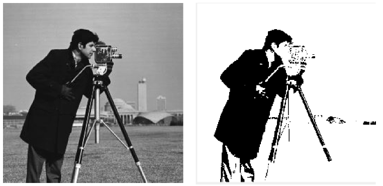
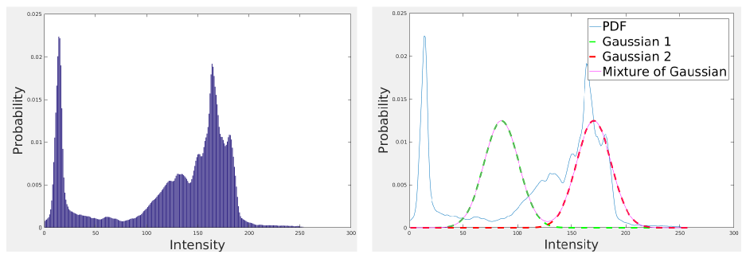
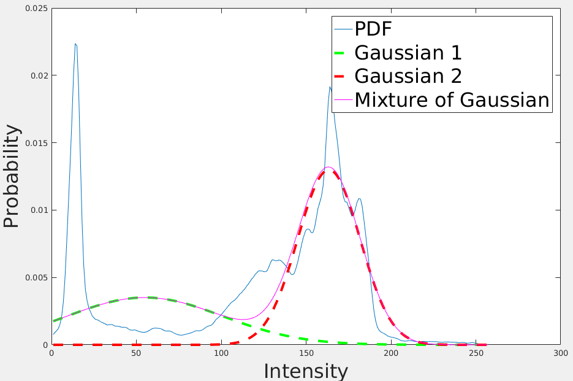
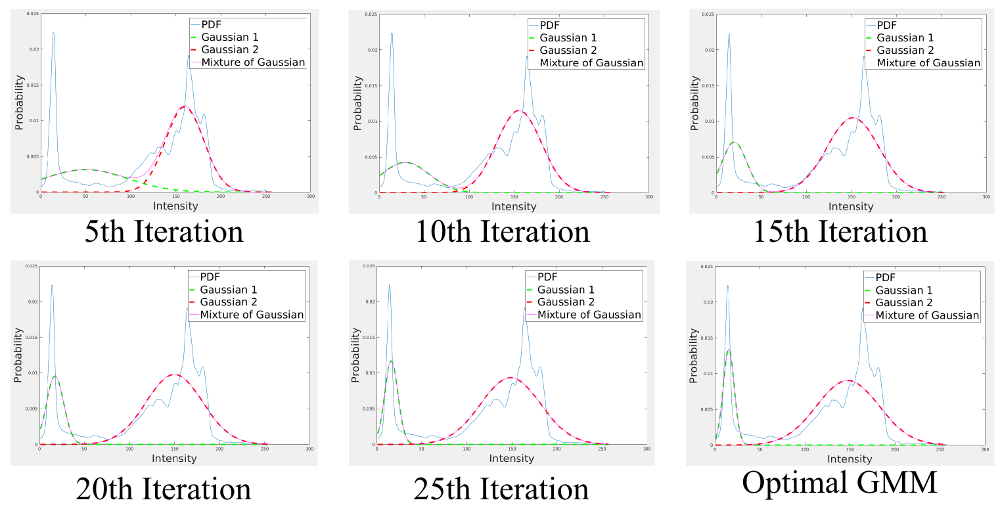
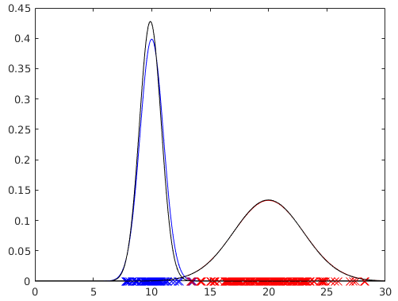
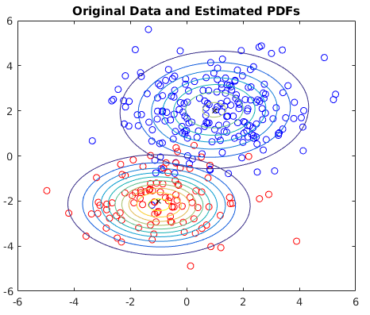

# Outline of Image Segmentation and Background Modeling using GMM

**Objective**

The distribution of image intensity can be modelled by a set of Gaussians (Mixture of Gaussian).  The Expectation Maxization algorithm iteratively maximize likelihood. EM algorithm on GMM for Image segmentation or data classification is a very classical problem in computer vision, see Fig. 1 as example.

Example: CameraMan image segmentation using EM algorithm.

Figure 1. CameraMan Image Segmentation using EM algorithm.

## Graphical Explaination

**Step 1. Initialization**:

Divide the data into K parts, compute the Gaussians for each set of data. In this example, K = 2, so that intensity ranging from [0, 127] and [127, 255] are used to model two Gaussians (Green dashed line and Red dashed line in Fig. 2).

Figure 2. Initialization of EM Segmentation.

**Step 2. Expectation Maximization**

**Expectation step**: we compute the log-likelihood of the Gaussians using the PDF(probability density function) of the image as prior. The PDF can be considered as the normalized image histogram by the total number of pixels. **Maximization Step**: compute the weight of the Gaussian and update the GMM model.  Figure 3 shows the update of the two Gaussian after the first iteration. This step is iteratively performed until converge. 

Figure 3. First iteration of EM algorithm.

Figure 4. Envolution of Gaussian Mixture Model in EM Iterations.

Once the EM algorithm converge, we can estimate two stable Gaussians. To segment the image, we need to assign each pixel to be either belonging to Gaussian 1 or Gaussian 2. To do so, we compute the probability using Gaussian 1 and Gaussian 2. Take the Optimal GMM in Fig. 4 as example, intensity value 150 has probability close to zero, while probability about 0.01. Accordingly, for all the pixels that has intensity of 150 will be classified as Gaussian 2. Doing so, we can get segmentation result as shown in Fig. 1.

## Extension to Background Modelling

For background modelling of static camera, let a set of images taken from t = 0 to t = n, each pixel as has n different intensities (or color values). Then we model K Gaussians of the n intensity values, similar to the former discussions. Accordingly, for a N x M size image, each pixel we model K Gaussians, we have totally N x M x K Gaussians to represent the state of the image pixels. Each new observation will be used to update the set of Gaussians.

To identify the background Gaussians and  foreground Gaussians, we basically consider the Gaussians with higher weight while smaller varances, details can be found in Stauffer and Grimson's paper [Adaptive background mixture models for real-time tracking](http://www.ai.mit.edu/projects/vsam/Publications/stauffer_cvpr98_track.pdf).

## Supplementary Materials

1. EM_demo.m %Matlab file for image segmentation using EM algorithm, see Fig. 1. 

2. GMMExample_1D.m % Synthetic experiment for GMM on 1-D data clustering

3. GMMExample_2D.m % Synthetic experiment for GMM on 1-D data clustering

4. [Simple video tutorial](https://www.youtube.com/watch?v=iQoXFmbXRJA)
