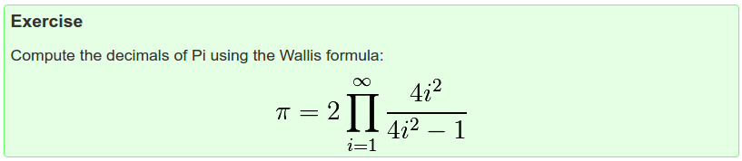
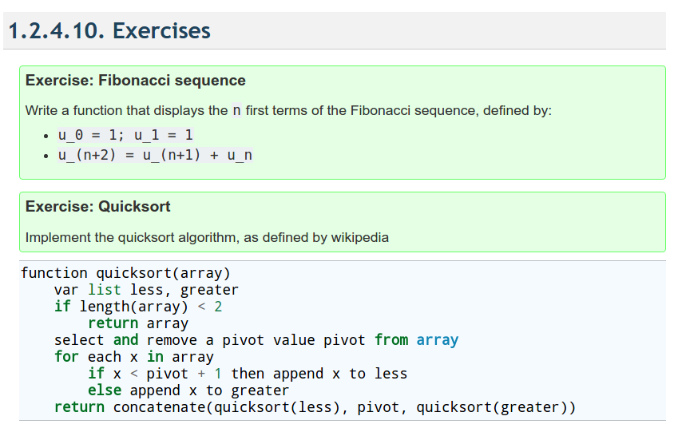
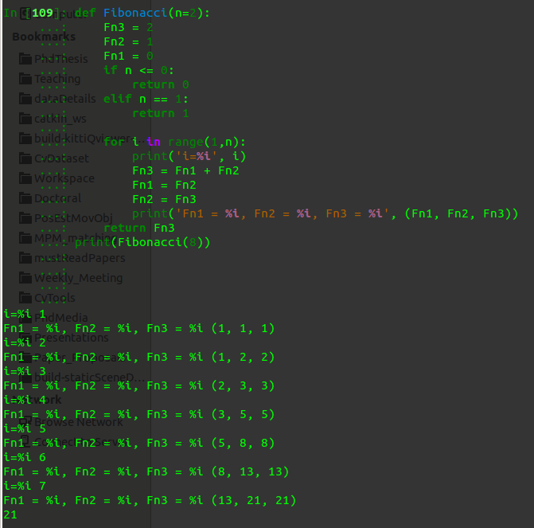

# Python Tutorial Exercise

## 1-2-3 Control Flow

**Answer:**

	def wallis(n):
    		pi = 0.0   
    		for i in range(1, n):
       			 x = 4 * (i ** 2)
       			 y = x - 1
       			 z = float(x) / float(y)
       			 if (i == 1):
           			pi = z
        		else:
            			pi *= z
    				pi *= 2
   			return pi
	print(wallis(100000))
	
	
## 1-2-3 Defining Functions	

	def Fibonacci(n=2):
		Fn3 = 2
		Fn2 = 1
		Fn1 = 0
		if n <= 0:
			return 0
		else if n = 1:
			return 1
		
		for i in range(1,n):
			Fn3 = Fn1 + Fn2
			Fn1 = Fn2
			Fn2 = Fn3
		return Fn3
		
	print(Fibonacci(10))